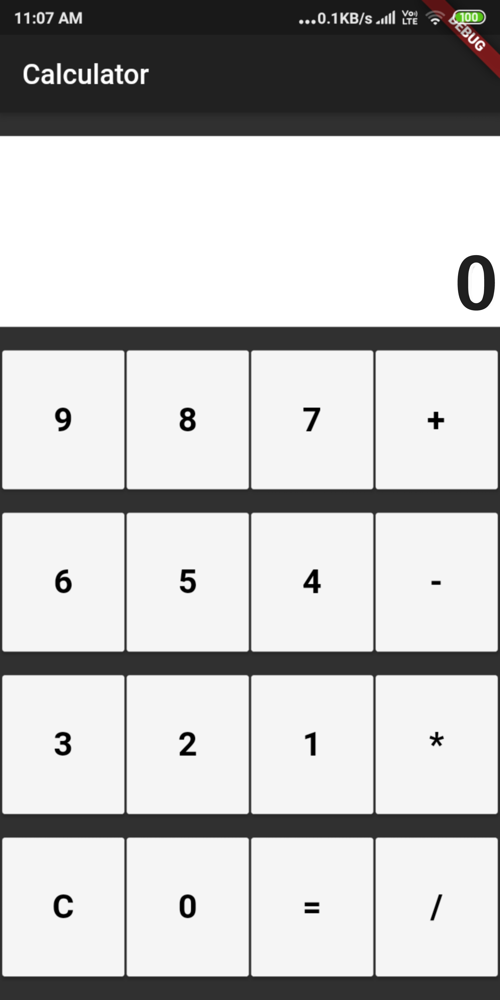
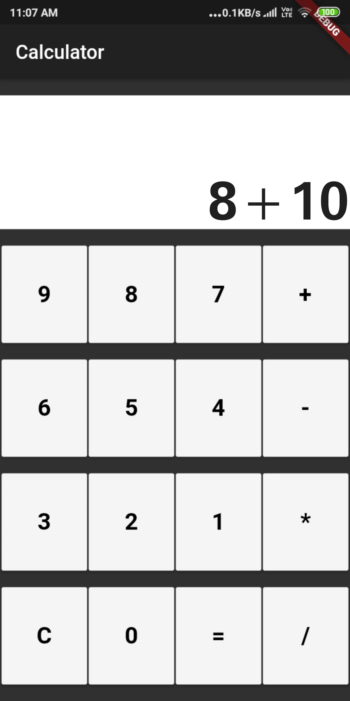
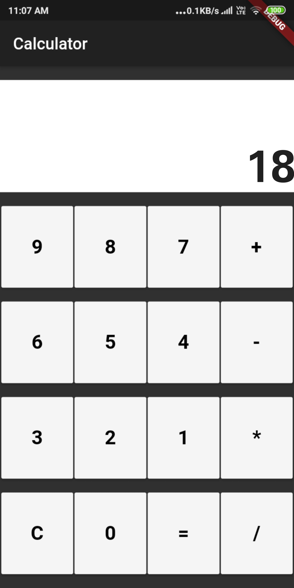

# calculator_app
My Flutter project.

Project Name: Calculator

Project summary: This is a basic simple calculator project. 
It can be used to do various arithmetic calculations like addition, subtraction,multiplication and division. 
This project will have a user interface with numbers and arithmetic operations.

Designed by: Cinchana S

